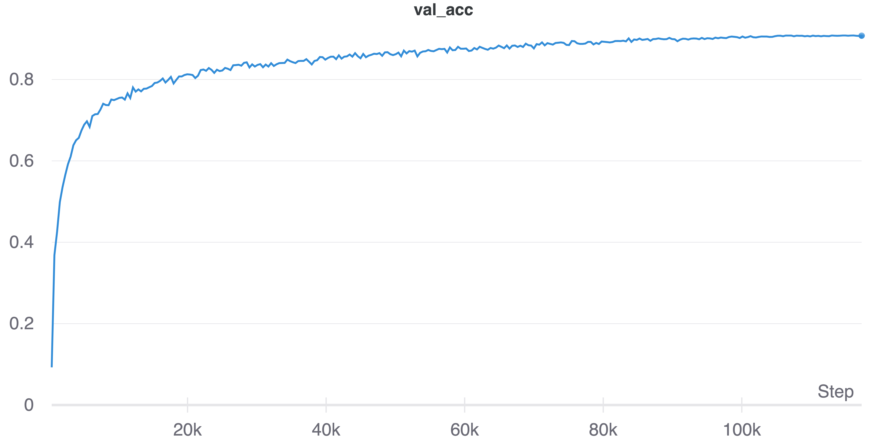
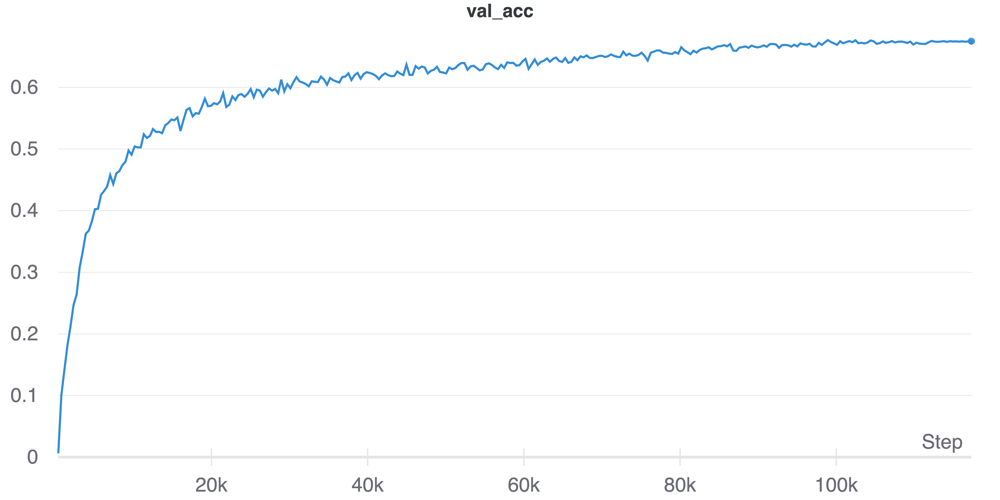
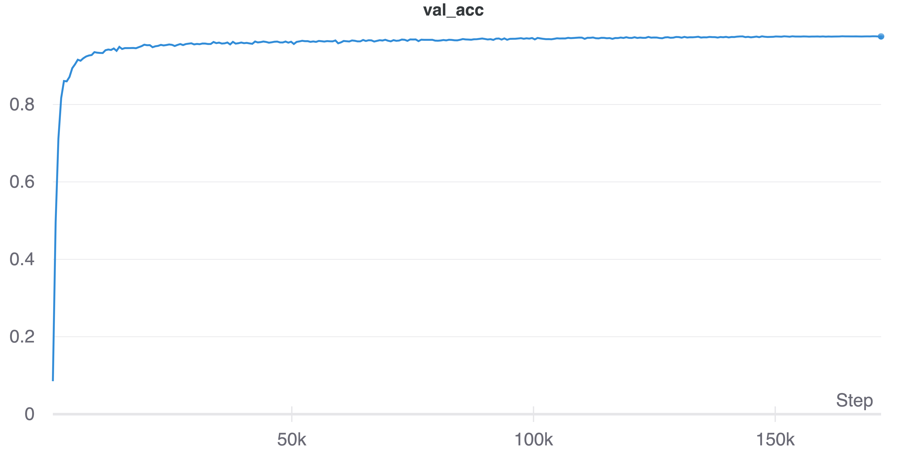

# MLP-Mixer-CIFAR
PyTorch implementation of **Mixer-nano** (#parameters is **0.67M**, originally Mixer-S/16 has 18M) with **90.83 % acc.** on CIFAR-10. Training from scratch.

## 1.Prerequisite
* Python 3.9.6
* PyTorch 1.10.0
* [Weights and Biases](https://wandb.ai/site) account for logging experiments.

## 2.Quick Start
```shell
$git clone https://github.com/omihub777/MLP-Mixer-CIFAR.git
$cd MLP-Mixer-CIFAR
$bash setup.sh
$python main.py --model mlp_mixer --dataset c10
```

## 3.Result
|Dataset|Acc.(%)|Time(hh:mm:ss)|Steps|
|:--:|:--:|:--:|:--:|
|CIFAR-10|**90.83%**|3:34.31|117.3k|
|CIFAR-100|**67.51%**|3:35.26|117.3k|
|SVHN|**97.63%**|5:23.26|171.9k|
* Number of Parameters: 0.67M
* Device: P100 (single GPU)

### 3.1 CIFAR-10
* Accuracy



### 3.2 CIFAR-100
* Accuracy




### 3.3 SVHN
* Accuracy




## 4. Resources
* [MLP-Mixer: An all-MLP Architecture for Vision, Tolstikhin, I., (2021)](https://arxiv.org/abs/2105.01601)